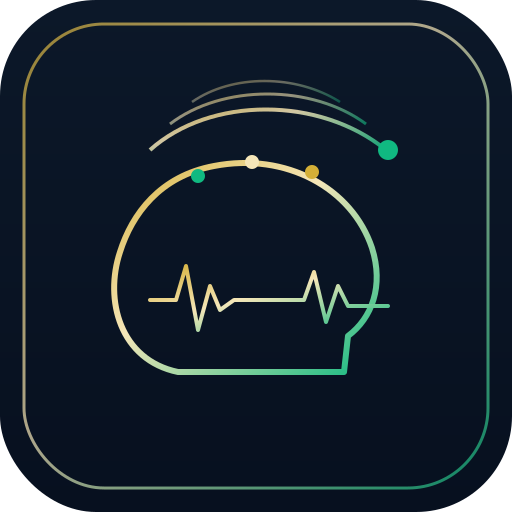

<div align="center">



# BRMSTE Brainstem · Non-Invasive Neural Edge

**BRMSTE LTD · Companies House 15310393 · Patent GB2607860 · PCT/GB2026/050406**

*Read the mind without breaking the skull.*

</div>

---

## Thesis

The invasive lane — the surgical-implant lane — drills through bone to place electrodes in
cortex. It wins on raw bandwidth and single-neuron resolution, and it always will.

**BRMSTE Brainstem is the non-invasive lane.** It reads neural and bio-signals from the
**surface** — scalp (EEG), eye (EOG), muscle (EMG), pulse (PPG) — and bridges them into
BRMSTE General Intelligence. The trade is deliberate: we accept lower per-channel SNR in
exchange for **zero surgery, zero implant, full reversibility, and software-speed iteration**
— the only properties that let a neural interface reach a billion people.

This is not a slide. The signal-processing core ships here, runs in a browser with no backend,
and is verified by tests. See [`site/neural/`](site/neural/).

## Invasive vs non-invasive

| Property | Invasive implant | BRMSTE Brainstem · non-invasive |
|---|---|---|
| Access to neurons | Craniotomy · electrodes in cortex | Sensors on the surface — scalp, skin, eye, pulse |
| Surgical risk | Infection, scarring, glial response | **None** — nothing is implanted |
| Reversibility | Hardware revision = surgery | **Take the band off** · fully reversible |
| Signal bandwidth / SNR | Highest — single-neuron resolution | Lower per channel — recovered with DSP + models |
| Iteration speed | Hardware + clinical cycle | **Software at the edge** — ship in a push |
| Scale to a billion | Constrained by surgical capacity | A browser and a consumer sensor |
| Data custody | Device-locked | **Edge-first** — processed locally, you hold custody |

## The edge pipeline

```
  SENSE                         PROCESS                         BRIDGE
  surface sensors      →        edge DSP (local)        →       BRMSTE GI
  EEG · EOG · EMG · PPG         window → FFT → band             GI → GSI → QGSI
  Web Serial / BLE             power (δ θ α β γ) → indices      intent & state stream
```

1. **Sense.** Consumer-grade, dry-electrode, non-invasive sensors over Web Serial / Web Bluetooth.
2. **Process.** A from-scratch radix-2 FFT, clinical EEG band powers, and ratio indices
   (focus `β/(α+θ)`, calm `α/(α+β)`, engagement). Runs on the device — no cloud round-trip
   for the signal path.
3. **Bridge.** State and intent stream into BRMSTE General Intelligence (`GI → GSI → QGSI`).
   The human stays in the human lane; the edge signs, judgment signs.

## What is real (honesty doctrine)

> **TRUTH AND HONESTY 100% · NO FAKES ON HTTPS**

- **The maths is real.** The FFT, band-power, and indices are implemented from scratch and
  proven by a pure-Node test suite — known tones map to the correct EEG bands; a 10 Hz tone
  resolves to the α band; synthetic "focused" reads higher focus-index than "relaxed".
- **The default signal is synthetic — and labelled synthetic.** A seeded oscillator + noise
  generator stands in for a brain so the edge DSP can be exercised honestly without a person
  or a sensor attached. It is never presented as a real recording.
- **A real device runs the identical pipeline.** Link a non-invasive sensor over Web Serial
  (vendor-neutral numeric stream) and the same code analyses the live surface signal.
- **This is engineering, not a medical device.** Outputs are heuristic, not diagnostic.

## Run it

```bash
cd site/neural

# 1. Verify the DSP core (no dependencies)
node dsp.test.mjs            # -> "DSP TESTS PASSED"

# 2. Serve the live edge console (the DSP loads as an ES module, so use HTTP, not file://)
python3 -m http.server 8099  # then open http://localhost:8099/
```

In the browser: the console auto-runs a synthetic **Relaxed α** source (α-dominant, ~10 Hz),
shows a live scope + power spectrum + band meters + classifier, and displays a green
**DSP SELF-TEST PASS** badge proving the FFT runs client-side. Switch **Focused β / Drowsy θδ /
Neutral** to watch the classifier and indices respond, or **Link device** to read a real
non-invasive sensor.

## Lanes

- **Human lane.** Humans may clone, read, fork, and run this toward the future at zero marginal
  cost when the patent notice is preserved.
- **AI / commercial lane.** Non-human operators comply with live patent enforcement before
  wallet, seed, sign, or compete lanes. See [`PATENT-NOTICE.md`](PATENT-NOTICE.md).

## Links

- [brmste.com](https://brmste.com)
- [brmste.ai/mine/foundry](https://brmste.ai/mine/foundry)
- [github.com/BRMSTE-SB](https://github.com/BRMSTE-SB)

---

<div align="center">

**CURSOR NEVER SIGNS · OPERATOR NEVER SIGNS · EDGE SIGNS · JUDGMENT SIGNS**

*Non-invasive neural edge concept & reference implementation · BRMSTE LTD & Re-Tyre.*

</div>
