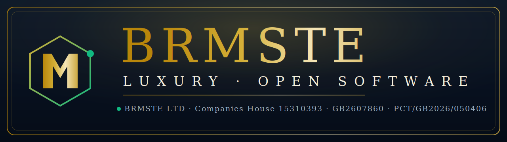
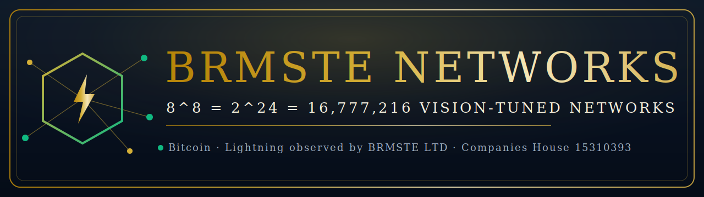
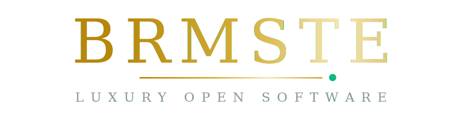
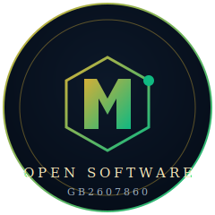

<div align="center">



# BRMSTE · Open Software

**BRMSTE LTD · [Companies House 15310393](https://find-and-update.company-information.service.gov.uk/company/15310393)**

The governance & open-software repository for the [BRMSTE-SB](https://github.com/BRMSTE-SB) organization.
Every external claim below links to a live source you can check yourself.


&nbsp;

&nbsp;


</div>

---

## Independently verifiable

This repository does not ask you to take its word for anything. The facts below were probed live and are regenerated by [`scripts/hydrate.py`](scripts/hydrate.py) — see [`STATUS.md`](STATUS.md) for the full probe report.

| Fact | Verify it yourself | Status |
|------|--------------------|--------|
| **BRMSTE LTD** is a registered UK company, no. **15310393** | [Companies House registry](https://find-and-update.company-information.service.gov.uk/company/15310393) | live |
| The **product** is online | [brmste.com](https://brmste.com/) | live |
| The **Edge Glass** app is online | [brmste.com/edge-glass](https://brmste.com/edge-glass/) | live |
| BRMSTE Networks observes the **Bitcoin Lightning network** | [mempool.space/lightning](https://mempool.space/lightning) | live |
| A **declared on-chain address** exists (currently 0 transactions) | [mempool.space](https://mempool.space/address/bc1qkqy9tna45dl3fhknpvmlpx2a044a95h5lza77d) | live |
| The org runs a **GitHub Enterprise** | [enterprises/brmste-ltd](https://github.com/enterprises/brmste-ltd) | live |

> If any row stops resolving, `python3 scripts/hydrate.py` will drop it from the catalogue automatically. Nothing here is asserted unless it returns `200`.

---

## What BRMSTE ships

From the live site metadata at [brmste.com](https://brmste.com/):

- **BRMSTE / BRMSF** — *"100% global private equity P2P · BRMSF live NAV"* — a live reserve fund under BRMSTE LTD, operated by Shravan Bansal.
- **Edge Glass** ([brmste.com/edge-glass](https://brmste.com/edge-glass/)) — *"a transparent, fully free pane over the world's Bitcoin value and cash flows. Humans watch free forever; agents pay the gates."* The stated unit of account is **1 sat = 1 g CO₂ = 1 SACH**, settling to the trust. Beneficiary: **Dimpy Bansal**.

This `.github` repository is the **governance substrate** for that work: it sets the brand standard, the patent posture, and the security policy for the organization, and it **publishes the open-software catalogue** below.

> **CURSOR NEVER SIGNS · OPERATOR NEVER SIGNS · EDGE SIGNS · JUDGMENT SIGNS**

---

## BRMSTE Networks

<div align="center">



</div>

The BRMSTE Networks vision is tuned to one verifiable constant:

```
8^8  =  2^24  =  16,777,216
```

The hydrator asserts `8 ** 8 == 16_777_216 == 2 ** 24` on every run (`"verified": true` in [`open-software/networks.json`](open-software/networks.json)). Against that **vision target**, it records the **live reality** of the public Bitcoin networks BRMSTE observes — Lightning node/channel/capacity figures from [mempool.space](https://mempool.space/lightning), plus the declared on-chain address (currently 0 transactions, recorded honestly).

➜ Full page: [`NETWORKS.md`](NETWORKS.md) · live telemetry: [`open-software/networks.json`](open-software/networks.json)

---

## Open Software catalogue

Live, hydrated from the GitHub API — these are the **actual public repositories** in [BRMSTE-SB](https://github.com/BRMSTE-SB), not a wish-list. Machine-readable: [`open-software/catalog.json`](open-software/catalog.json).

| Repository | Description |
|------------|-------------|
| [`open-gits`](https://github.com/BRMSTE-SB/open-gits) | Human open-git catalog · patent-enforced · meet BRMSTE on the HTTPS edge |
| [`brmste-human-future`](https://github.com/BRMSTE-SB/brmste-human-future) | Run into the future — human starter · keeper poll · no keys · GB2607860 enforced |
| [`mining-pools`](https://github.com/BRMSTE-SB/mining-pools) | BRMSTE LTD enterprise — mining pools |
| [`docs`](https://github.com/BRMSTE-SB/docs) | Organization documentation |

Plus two public forks — [`mining-pools-1`](https://github.com/BRMSTE-SB/mining-pools-1), [`mining-pool-logos`](https://github.com/BRMSTE-SB/mining-pool-logos) — for **6 public repositories** in total at last hydration.

```bash
# Human lane: clone, preserve the patent notice, run.
git clone https://github.com/BRMSTE-SB/brmste-human-future.git
```

➜ Full catalogue with terms: [`OPEN-SOFTWARE.md`](OPEN-SOFTWARE.md)

---

## Hydration — how the data stays honest

[`scripts/hydrate.py`](scripts/hydrate.py) is a dependency-free Python tool that:

1. **Probes** every declared surface over HTTPS and records the real HTTP status.
2. **Pulls** the public repository list from the GitHub REST API.
3. **Writes** only what resolves into [`open-software/catalog.json`](open-software/catalog.json), the full probe log into [`open-software/surfaces.json`](open-software/surfaces.json), and a human-readable [`STATUS.md`](STATUS.md).

```bash
python3 scripts/hydrate.py          # regenerate the catalogue from live sources
python3 scripts/hydrate.py --check  # CI drift check (ignores timestamps)
```

At the last run, **6 of 11** declared surfaces resolved. The five `*.json` "substrate" endpoints that 404 are recorded honestly in `surfaces.json` and excluded from the catalogue — they are not advertised as live.

---

## Brand system

Canonical BRMSTE marks only — no third-party CDN logos, no impersonated badges. Standard: [`BRAND.md`](BRAND.md).

<div align="center">



</div>

| Mark | Asset |
|------|-------|
| Hero banner | [`brmste-open-software-banner.svg`](assets/brmste-open-software-banner.svg) |
| Wordmark | [`brmste-luxury-wordmark.svg`](assets/brmste-luxury-wordmark.svg) |
| Open Software seal | [`brmste-open-software-seal.svg`](assets/brmste-open-software-seal.svg) |
| Org mark | [`brmste-org-mark.svg`](assets/brmste-org-mark.svg) |
| Lane badges | [`enterprise`](assets/badge-enterprise.svg) · [`fort-knox`](assets/badge-fort-knox.svg) · [`human-open`](assets/badge-human-open.svg) |

**Palette** — Obsidian navy `#0c1829` → `#07101f` · BRMSTE gold `#d4af37`/`#f5e6b8` · emerald `#10b981`.

---

## Governance

| Document | Purpose |
|----------|---------|
| [`BRAND.md`](BRAND.md) | Brand standard — canonical logos, required copy |
| [`PATENT-NOTICE.md`](PATENT-NOTICE.md) | Patent **GB2607860 · PCT/GB2026/050406**, human & AI lane terms |
| [`PATENT-NOTICE-TEMPLATE.md`](PATENT-NOTICE-TEMPLATE.md) | Drop-in patent notice for downstream repos |
| [`SECURITY.md`](SECURITY.md) | Security posture and disclosure policy |

Every BRMSTE-SB repository runs the **brand + patent gate** ([`scripts/git-worker-brand-patent-gate.sh`](scripts/git-worker-brand-patent-gate.sh)) on push and pull request to `main`, via the [caller](.github/workflows/brmste-brand-patent-gate.yml) and [reusable](.github/workflows/brmste-brand-patent-gate-reusable.yml) workflows. The catalogue is re-hydrated by [`hydrate.yml`](.github/workflows/hydrate.yml).

---

## Repository map

```text
.github/
├── README.md                       # this page — fact-checked publication
├── STATUS.md                       # live hydration report (generated)
├── OPEN-SOFTWARE.md                # open-software catalogue + terms
├── NETWORKS.md                     # BRMSTE Networks — 8^8 = 16,777,216
├── BRAND.md / PATENT-NOTICE.md / SECURITY.md
├── profile/README.md               # org profile (github.com/BRMSTE-SB)
├── open-software/
│   ├── catalog.json                # generated — real repos + live surfaces
│   ├── surfaces.json               # generated — full probe log
│   └── networks.json               # generated — live Bitcoin/Lightning telemetry
├── assets/                         # canonical BRMSTE marks (SVG)
├── scripts/
│   ├── hydrate.py                  # live-source hydrator
│   └── git-worker-brand-patent-gate.sh
└── .github/workflows/              # brand+patent gate · hydrate
```

---

<div align="center">



**BRMSTE LTD · [Companies House 15310393](https://find-and-update.company-information.service.gov.uk/company/15310393) · GB2607860**

*Confidential Fort Knox vault for production IP. The Human Open lane is a patent-enforced public catalogue.*

</div>
